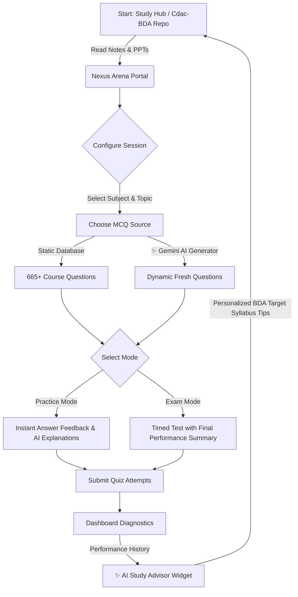

# Nexus Arena 🏆 - AI-Powered CDAC BDA Exam Prep Portal

Nexus Arena is a premium, client-side React application designed for aspirants preparing for the **CDAC Big Data Analytics (BDA)** exam. It combines a structured offline database of **665+ real syllabus questions** with **Google Gemini AI** to provide dynamic test generation and personalized study insights.

👉 **Live Portal URL**: **[https://957908.github.io/nexus-arena/](https://957908.github.io/nexus-arena/)**


---

## 🔄 Study & Practice Workflow



---

## ✨ Key Features

### 1. 📚 665+ Pre-loaded Exam Questions
- Complete subject coverage based on CDAC study materials:
  - **Java Programming** (100 questions)
  - **Python Programming** (100 questions)
  - **SQL & DBMS** (70 questions)
  - **Big Data Technologies** (40 questions)
  - **Cloud Computing** (80 questions)
  - **Linux Programming** (80 questions)
  - **Statistics & Analytics** (146 questions)
  - **Machine Learning & Deep Learning** (33 questions)
  - **Data Visualization** (16 questions)

### 2. 🤖 Gemini AI Question Generator
- Save your free Google Gemini API Key locally in **Settings (⚙️)**.
- Toggle **AI Generator Mode** on the configuration screen to ask Gemini to generate fresh, syllabus-aligned multiple-choice questions for any selected subject and topic on-the-fly!

### 📊 3. Smart Diagnostics & AI Study Advisor
- The dashboard automatically tracks your average accuracy, time spent, and quiz attempts.
- Highlights your **Key Strengths** and **Focus Areas** based on your scores.
- An **AI Study Advisor** panel synthesizes your recent mock results and queries Gemini to outline which topics you should focus on next.

### 🌗 4. Premium Responsive UI
- Sleek dark/light theme options built using an adaptive, slate-zinc SaaS design system.
- Fluid animations, clean borders, and robust mobile-responsive screens.
- **Serverless & Local Storage-First**: All your registration, progress metrics, notes, and theme choices are stored directly in your browser's memory, ensuring instant speed and privacy.

---

## 🛠️ Technology Stack
- **Frontend Framework**: React 19 + Vite
- **Styling**: Modern CSS Variables (Custom Zinc-Slate UI elements)
- **AI Engine**: Google Gemini API client integration (`gemini-2.5-flash`)
- **Deployment**: GitHub Pages (`gh-pages`)

---

## 🚀 Getting Started

### 1. Run Locally
Prerequisites: Make sure you have [Node.js](https://nodejs.org/) installed.

```bash
# Clone the repository (if downloaded from GitHub)
git clone https://github.com/957908/nexus-arena.git
cd nexus-arena

# Install dependencies
npm install

# Run the development server
npm run dev
```
Open your browser and navigate to: `http://localhost:5173`

---

## 🌎 Live Deployment (GitHub Pages)

This project is pre-configured to deploy to your GitHub Pages with a single command. 

```bash
# Compile and publish live
npm run deploy
```
This script will build the static assets (`dist`) and push them directly to your repository's `gh-pages` branch, updating the live URL instantly.
